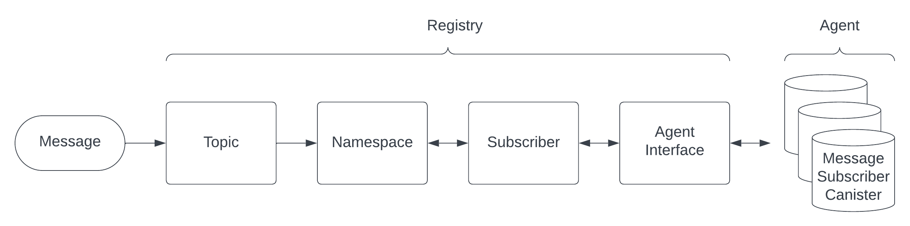

# Registry
The registry is the module that is used for configuration of the service bus. Topics, namespaces and subscriptions are registered with this module, and the registry is accessible for all other modules. There's a separate set of functions just to support the subscriber agent.  

**Message flow**<br/>
Topics, namespaces and subscriptions are registered to support the message flow from message intake to message delivery.



## Namespace Functions
Namespaces are the core of the registry. Topic subscribers are registered in namespaces, and the namespaces are routing messages to subscriber canisters. Namespaces can be used to create collections of topics that are related (by topics or subscribers), and as load balancers if there's a large amount of subscribers.

### Add namespace  
```
fn namespace_register(namespace: Namespace)
```
Register a new namespace.

**Parameters**<br/>
&nbsp;&nbsp;&nbsp;&nbsp;*namespace*: A record of the type Namespace<br/><br/>
      
**Return**<br/>
&nbsp;&nbsp;&nbsp;&nbsp;Result&lt;String, String&gt;<br/><br/>
&nbsp;&nbsp;&nbsp;&nbsp;- *Ok*: Namespace ID<br/>
&nbsp;&nbsp;&nbsp;&nbsp;- *Err*: "Could not register the namespace"<br/><br/>

### Remove namespace
```
fn namespace_unregister(namespace_id: String)
```
Unregister a namespace.

**Parameters**<br/>
&nbsp;&nbsp;&nbsp;&nbsp;*namespace_id*: The ID string of the namespace to remove 

**Return**<br/>
&nbsp;&nbsp;&nbsp;&nbsp;Result&lt;String, String&gt;<br/><br/>
&nbsp;&nbsp;&nbsp;&nbsp;- *Ok*: The removed namespace ID<br/>
&nbsp;&nbsp;&nbsp;&nbsp;- *Err*: "Could not unregister the namespace"<br/><br/>

### Get namespace details
```
async fn namespace(namespace_id: String) 
```
Get the namespace with a specific ID.

**Parameters**<br/>
&nbsp;&nbsp;&nbsp;&nbsp;*namespace_id*: The ID string of the namespace to get 

**Return**<br/>
&nbsp;&nbsp;&nbsp;&nbsp;Namespaces<br/><br/>
&nbsp;&nbsp;&nbsp;&nbsp;- *record {*<br/>
&nbsp;&nbsp;&nbsp;&nbsp;&nbsp;&nbsp;&nbsp;&nbsp;*id: text;*<br/>
&nbsp;&nbsp;&nbsp;&nbsp;&nbsp;&nbsp;&nbsp;&nbsp;*name: text;*<br/>
&nbsp;&nbsp;&nbsp;&nbsp;&nbsp;&nbsp;&nbsp;&nbsp;*description: text;*<br/>
&nbsp;&nbsp;&nbsp;&nbsp;&nbsp;&nbsp;&nbsp;&nbsp;*subscribers: vec text;*<br/>
&nbsp;&nbsp;&nbsp;&nbsp;&nbsp;&nbsp;&nbsp;&nbsp;*active: bool;*<br/>
&nbsp;&nbsp;&nbsp;&nbsp;*};*<br/><br/>

### Get all namespaces
```
async fn get_subscriptions()
```
Get all namespaces

**Parameters**<br/>
&nbsp;&nbsp;&nbsp;&nbsp;(none) 

**Return**<br/>
&nbsp;&nbsp;&nbsp;&nbsp;Vec&lt;Namespaces&gt;<br/><br/>
&nbsp;&nbsp;&nbsp;&nbsp;- *vec {*<br/>
&nbsp;&nbsp;&nbsp;&nbsp;&nbsp;&nbsp;&nbsp;&nbsp;*record {*<br/>
&nbsp;&nbsp;&nbsp;&nbsp;&nbsp;&nbsp;&nbsp;&nbsp;&nbsp;&nbsp;&nbsp;&nbsp;*id: text;*<br/>
&nbsp;&nbsp;&nbsp;&nbsp;&nbsp;&nbsp;&nbsp;&nbsp;&nbsp;&nbsp;&nbsp;&nbsp;*name: text;*<br/>
&nbsp;&nbsp;&nbsp;&nbsp;&nbsp;&nbsp;&nbsp;&nbsp;&nbsp;&nbsp;&nbsp;&nbsp;*description: text;*<br/>
&nbsp;&nbsp;&nbsp;&nbsp;&nbsp;&nbsp;&nbsp;&nbsp;&nbsp;&nbsp;&nbsp;&nbsp;*subscribers: vec text;*<br/>
&nbsp;&nbsp;&nbsp;&nbsp;&nbsp;&nbsp;&nbsp;&nbsp;&nbsp;&nbsp;&nbsp;&nbsp;*active: bool;*<br/>
&nbsp;&nbsp;&nbsp;&nbsp;&nbsp;&nbsp;&nbsp;&nbsp;*}*<br/>
&nbsp;&nbsp;&nbsp;&nbsp;*};*<br/><br/>

### Add subscriber to namespace
```
fn namespace_register_subscriber(namespace_id: String, subscriber_id: String)
```
Add a created, unassigned subscriber to a namespace. 

**Parameters**<br/>
&nbsp;&nbsp;&nbsp;&nbsp;*namespace_id*: The ID string of the namespace<br/>
&nbsp;&nbsp;&nbsp;&nbsp;*subscriber_id*: The ID string of the subscriber to add

**Return**<br/>
&nbsp;&nbsp;&nbsp;&nbsp;Result&lt;String, String&gt;<br/><br/>
&nbsp;&nbsp;&nbsp;&nbsp;- *Ok*: The namespace ID<br/>
&nbsp;&nbsp;&nbsp;&nbsp;- *Err*: "Could not add subscriber"<br/><br/>

### Get namespace subscriber count
```
fn namespace_subscriber_size(namespace_id: String)
```
Get the number of subscribers a specific namespace has 

**Parameters**<br/>
&nbsp;&nbsp;&nbsp;&nbsp;*namespace_id*: The ID string of the namespace

**Return**<br/>
&nbsp;&nbsp;&nbsp;&nbsp;usize<br/><br/>

### Get namespaces by topic
```
fn namespaces_by_topic(topic_id: String) 
```
Get all namespaces registered for a specific topic

**Parameters**<br/>
&nbsp;&nbsp;&nbsp;&nbsp;*topic_id*: The ID string of the topic

**Return**<br/>
&nbsp;&nbsp;&nbsp;&nbsp;Vec&lt;Namespaces&gt;<br/><br/>
&nbsp;&nbsp;&nbsp;&nbsp;- *vec {*<br/>
&nbsp;&nbsp;&nbsp;&nbsp;&nbsp;&nbsp;&nbsp;&nbsp;*record {*<br/>
&nbsp;&nbsp;&nbsp;&nbsp;&nbsp;&nbsp;&nbsp;&nbsp;&nbsp;&nbsp;&nbsp;&nbsp;*id: text;*<br/>
&nbsp;&nbsp;&nbsp;&nbsp;&nbsp;&nbsp;&nbsp;&nbsp;&nbsp;&nbsp;&nbsp;&nbsp;*name: text;*<br/>
&nbsp;&nbsp;&nbsp;&nbsp;&nbsp;&nbsp;&nbsp;&nbsp;&nbsp;&nbsp;&nbsp;&nbsp;*description: text;*<br/>
&nbsp;&nbsp;&nbsp;&nbsp;&nbsp;&nbsp;&nbsp;&nbsp;&nbsp;&nbsp;&nbsp;&nbsp;*subscribers: vec text;*<br/>
&nbsp;&nbsp;&nbsp;&nbsp;&nbsp;&nbsp;&nbsp;&nbsp;&nbsp;&nbsp;&nbsp;&nbsp;*active: bool;*<br/>
&nbsp;&nbsp;&nbsp;&nbsp;&nbsp;&nbsp;&nbsp;&nbsp;*}*<br/>
&nbsp;&nbsp;&nbsp;&nbsp;*};*<br/><br/>

### Get namespace by subscriber
```
fn namespace_by_subscriber(subscriber_id: String)
```
Get the namespace of a specific subscriber is subscribing to

**Parameters**<br/>
&nbsp;&nbsp;&nbsp;&nbsp;*subscriber_id*: The ID string of the subscriber 

**Return**<br/>
&nbsp;&nbsp;&nbsp;&nbsp;Namespaces<br/><br/>
&nbsp;&nbsp;&nbsp;&nbsp;- *record {*<br/>
&nbsp;&nbsp;&nbsp;&nbsp;&nbsp;&nbsp;&nbsp;&nbsp;*id: text;*<br/>
&nbsp;&nbsp;&nbsp;&nbsp;&nbsp;&nbsp;&nbsp;&nbsp;*name: text;*<br/>
&nbsp;&nbsp;&nbsp;&nbsp;&nbsp;&nbsp;&nbsp;&nbsp;*description: text;*<br/>
&nbsp;&nbsp;&nbsp;&nbsp;&nbsp;&nbsp;&nbsp;&nbsp;*subscribers: vec text;*<br/>
&nbsp;&nbsp;&nbsp;&nbsp;&nbsp;&nbsp;&nbsp;&nbsp;*active: bool;*<br/>
&nbsp;&nbsp;&nbsp;&nbsp;*};*<br/><br/>


## Topic functions
Topics are the data channel the subscribers are subscribing to. The message intake system will forward data messages to topics.

### Add topic  
```
fn topic_register(topic: Topic)
```
Register a new topic

**Parameters**<br/>
&nbsp;&nbsp;&nbsp;&nbsp;*namespace*: A record of the type Topic<br/><br/>
      
**Return**<br/>
&nbsp;&nbsp;&nbsp;&nbsp;Result&lt;String, String&gt;<br/><br/>
&nbsp;&nbsp;&nbsp;&nbsp;- *Ok*: Topic ID<br/>
&nbsp;&nbsp;&nbsp;&nbsp;- *Err*: "Could not register the topic"<br/><br/>

### Remove topic
```
fn topic_unregister(topic_id: String)
```
Unregister a topic

**Parameters**<br/>
&nbsp;&nbsp;&nbsp;&nbsp;*topic_id*: The ID string of the topic to remove 

**Return**<br/>
&nbsp;&nbsp;&nbsp;&nbsp;Result&lt;String, String&gt;<br/><br/>
&nbsp;&nbsp;&nbsp;&nbsp;- *Ok*: The removed topic ID<br/>
&nbsp;&nbsp;&nbsp;&nbsp;- *Err*: "Could not unregister topic"<br/><br/>

### Get topic details
```
fn topic(topic_id: String)  
```
Get the topic with a specific ID.

**Parameters**<br/>
&nbsp;&nbsp;&nbsp;&nbsp;*topic_id*: The ID string of the topic to get 

**Return**<br/>
&nbsp;&nbsp;&nbsp;&nbsp;Topics<br/><br/>
&nbsp;&nbsp;&nbsp;&nbsp;- *record {*<br/>
&nbsp;&nbsp;&nbsp;&nbsp;&nbsp;&nbsp;&nbsp;&nbsp;*id: text;*<br/>
&nbsp;&nbsp;&nbsp;&nbsp;&nbsp;&nbsp;&nbsp;&nbsp;*name: text;*<br/>
&nbsp;&nbsp;&nbsp;&nbsp;&nbsp;&nbsp;&nbsp;&nbsp;*description: text;*<br/>
&nbsp;&nbsp;&nbsp;&nbsp;&nbsp;&nbsp;&nbsp;&nbsp;*namespaces: vec text;*<br/>
&nbsp;&nbsp;&nbsp;&nbsp;&nbsp;&nbsp;&nbsp;&nbsp;*active: bool;*<br/>
&nbsp;&nbsp;&nbsp;&nbsp;*};*<br/><br/>

### Get all topics
```
fn topics()
```
Get all topics

**Parameters**<br/>
&nbsp;&nbsp;&nbsp;&nbsp;(none) 

**Return**<br/>
&nbsp;&nbsp;&nbsp;&nbsp;Vec&lt;Topics&gt;<br/><br/>
&nbsp;&nbsp;&nbsp;&nbsp;- *vec {*<br/>
&nbsp;&nbsp;&nbsp;&nbsp;&nbsp;&nbsp;&nbsp;&nbsp;*record {*<br/>
&nbsp;&nbsp;&nbsp;&nbsp;&nbsp;&nbsp;&nbsp;&nbsp;&nbsp;&nbsp;&nbsp;&nbsp;*id: text;*<br/>
&nbsp;&nbsp;&nbsp;&nbsp;&nbsp;&nbsp;&nbsp;&nbsp;&nbsp;&nbsp;&nbsp;&nbsp;*name: text;*<br/>
&nbsp;&nbsp;&nbsp;&nbsp;&nbsp;&nbsp;&nbsp;&nbsp;&nbsp;&nbsp;&nbsp;&nbsp;*description: text;*<br/>
&nbsp;&nbsp;&nbsp;&nbsp;&nbsp;&nbsp;&nbsp;&nbsp;&nbsp;&nbsp;&nbsp;&nbsp;*namespaces: vec text;*<br/>
&nbsp;&nbsp;&nbsp;&nbsp;&nbsp;&nbsp;&nbsp;&nbsp;&nbsp;&nbsp;&nbsp;&nbsp;*active: bool;*<br/>
&nbsp;&nbsp;&nbsp;&nbsp;&nbsp;&nbsp;&nbsp;&nbsp;*}*<br/>
&nbsp;&nbsp;&nbsp;&nbsp;*};*<br/><br/>

### Get topic by name
```
fn topic_by_name(topic_name: String)
```
Get a topic by it's name. Clients are identifying topics by name, and not by ID, which makes this function useful.

**Parameters**<br/>
&nbsp;&nbsp;&nbsp;&nbsp;*topic_name*: The name of the topic to get 

**Return**<br/>
&nbsp;&nbsp;&nbsp;&nbsp;Topics<br/><br/>
&nbsp;&nbsp;&nbsp;&nbsp;- *record {*<br/>
&nbsp;&nbsp;&nbsp;&nbsp;&nbsp;&nbsp;&nbsp;&nbsp;*id: text;*<br/>
&nbsp;&nbsp;&nbsp;&nbsp;&nbsp;&nbsp;&nbsp;&nbsp;*name: text;*<br/>
&nbsp;&nbsp;&nbsp;&nbsp;&nbsp;&nbsp;&nbsp;&nbsp;*description: text;*<br/>
&nbsp;&nbsp;&nbsp;&nbsp;&nbsp;&nbsp;&nbsp;&nbsp;*namespaces: vec text;*<br/>
&nbsp;&nbsp;&nbsp;&nbsp;&nbsp;&nbsp;&nbsp;&nbsp;*active: bool;*<br/>
&nbsp;&nbsp;&nbsp;&nbsp;*};*<br/><br/>

## Subscriber functions
Subscribers are the receivers of messages distributed through the service bus. Subscribers can subscribe to topics, and the topic messages are delivered to the callback function specified by the subscriber.

### Add subscriber  
```
pub async fn subscriber_register(subscriber: Subscribers)
```
Register a new subscriber

**Parameters**<br/>
&nbsp;&nbsp;&nbsp;&nbsp;*subscriber*: A record of the type Subscribers<br/><br/>
      
**Return**<br/>
&nbsp;&nbsp;&nbsp;&nbsp;Result&lt;String, String&gt;<br/><br/>
&nbsp;&nbsp;&nbsp;&nbsp;- *Ok*: subscriber ID<br/>
&nbsp;&nbsp;&nbsp;&nbsp;- *Err*: "Could not unregister topic"<br/><br/>

### Remove subscriber
```
fn subscriber_unregister(subscriber_id: String)
```
Unregister a subscriber

**Parameters**<br/>
&nbsp;&nbsp;&nbsp;&nbsp;*subscriber_id*: The ID string of the subscriber to remove 

**Return**<br/>
&nbsp;&nbsp;&nbsp;&nbsp;Result&lt;String, String&gt;<br/><br/>
&nbsp;&nbsp;&nbsp;&nbsp;- *Ok*: The removed subscriber ID<br/>
&nbsp;&nbsp;&nbsp;&nbsp;- *Err*: "Could not unregister subscriber"<br/><br/>

### Get topic details
```
fn subscriber(subscriber_id: String) 
```
Get the subscriber with a specific ID.

**Parameters**<br/>
&nbsp;&nbsp;&nbsp;&nbsp;*subscriber_id*: The ID string of the subscriber to get 

**Return**<br/>
&nbsp;&nbsp;&nbsp;&nbsp;Subscribers<br/><br/>
&nbsp;&nbsp;&nbsp;&nbsp;- *record {*<br/>
&nbsp;&nbsp;&nbsp;&nbsp;&nbsp;&nbsp;&nbsp;&nbsp;*id: text;*<br/>
&nbsp;&nbsp;&nbsp;&nbsp;&nbsp;&nbsp;&nbsp;&nbsp;*canister_id: text;*<br/>
&nbsp;&nbsp;&nbsp;&nbsp;&nbsp;&nbsp;&nbsp;&nbsp;*callback: text;*<br/>
&nbsp;&nbsp;&nbsp;&nbsp;&nbsp;&nbsp;&nbsp;&nbsp;*name: text;*<br/>
&nbsp;&nbsp;&nbsp;&nbsp;&nbsp;&nbsp;&nbsp;&nbsp;*description: text;*<br/>
&nbsp;&nbsp;&nbsp;&nbsp;&nbsp;&nbsp;&nbsp;&nbsp;*topic: text;*<br/>
&nbsp;&nbsp;&nbsp;&nbsp;&nbsp;&nbsp;&nbsp;&nbsp;*namespaces: vec text;*<br/>
&nbsp;&nbsp;&nbsp;&nbsp;&nbsp;&nbsp;&nbsp;&nbsp;*active: bool;*<br/>
&nbsp;&nbsp;&nbsp;&nbsp;*};*<br/><br/>

### Get all topics
```
fn subscribers()
```
Get all topics

**Parameters**<br/>
&nbsp;&nbsp;&nbsp;&nbsp;(none) 

**Return**<br/>
&nbsp;&nbsp;&nbsp;&nbsp;Vec&lt;Subscribers&gt;<br/><br/>
&nbsp;&nbsp;&nbsp;&nbsp;- *vec {*<br/>
&nbsp;&nbsp;&nbsp;&nbsp;&nbsp;&nbsp;&nbsp;&nbsp;*record {*<br/>
&nbsp;&nbsp;&nbsp;&nbsp;&nbsp;&nbsp;&nbsp;&nbsp;&nbsp;&nbsp;&nbsp;&nbsp;*id: text;*<br/>
&nbsp;&nbsp;&nbsp;&nbsp;&nbsp;&nbsp;&nbsp;&nbsp;&nbsp;&nbsp;&nbsp;&nbsp;*canister_id: text;*<br/>
&nbsp;&nbsp;&nbsp;&nbsp;&nbsp;&nbsp;&nbsp;&nbsp;&nbsp;&nbsp;&nbsp;&nbsp;*callback: text;*<br/>
&nbsp;&nbsp;&nbsp;&nbsp;&nbsp;&nbsp;&nbsp;&nbsp;&nbsp;&nbsp;&nbsp;&nbsp;*name: text;*<br/>
&nbsp;&nbsp;&nbsp;&nbsp;&nbsp;&nbsp;&nbsp;&nbsp;&nbsp;&nbsp;&nbsp;&nbsp;*description: text;*<br/>
&nbsp;&nbsp;&nbsp;&nbsp;&nbsp;&nbsp;&nbsp;&nbsp;&nbsp;&nbsp;&nbsp;&nbsp;*topic: text;*<br/>
&nbsp;&nbsp;&nbsp;&nbsp;&nbsp;&nbsp;&nbsp;&nbsp;&nbsp;&nbsp;&nbsp;&nbsp;*namespaces: vec text;*<br/>
&nbsp;&nbsp;&nbsp;&nbsp;&nbsp;&nbsp;&nbsp;&nbsp;&nbsp;&nbsp;&nbsp;&nbsp;*active: bool;*<br/>
&nbsp;&nbsp;&nbsp;&nbsp;&nbsp;&nbsp;&nbsp;&nbsp;*}*<br/>
&nbsp;&nbsp;&nbsp;&nbsp;*};*<br/><br/>

## Subscriber functions

### Add subscription  
```
async fn set_subscription(topic_name: String, callback: String)
```
Register topic subscription. Messages will be delivered to the callback function.

**Parameters**<br/>
&nbsp;&nbsp;&nbsp;&nbsp;*topic_name*: The name (string) of the topic to subscribe to <br/>
&nbsp;&nbsp;&nbsp;&nbsp;*callback*: The function the messages will be delivered to <br/>
      
**Return**<br/>
&nbsp;&nbsp;&nbsp;&nbsp;Result&lt;String, String&gt;<br/><br/>
&nbsp;&nbsp;&nbsp;&nbsp;- *Ok*: The subscription ID<br/>
&nbsp;&nbsp;&nbsp;&nbsp;- *Err*: "Could not register the subscriber"<br/><br/>

### Remove subscription
```
async fn unset_subscription(subscription_id: String)
```
Unregister topic subscription.

**Parameters**<br/>
&nbsp;&nbsp;&nbsp;&nbsp;*subscription_id*: The ID string of the subscription to remove 

**Return**<br/>
&nbsp;&nbsp;&nbsp;&nbsp;Result&lt;String, String&gt;<br/><br/>
&nbsp;&nbsp;&nbsp;&nbsp;- *Ok*: The removed subscription ID<br/>
&nbsp;&nbsp;&nbsp;&nbsp;- *Err*: "Could not unregister the subscriber"<br/><br/>

### Get subscription details
```
async fn get_subscription(subscription_id: String) 
```
Get the subscription with a specific ID.

**Parameters**<br/>
&nbsp;&nbsp;&nbsp;&nbsp;(none) 

**Return**<br/>
&nbsp;&nbsp;&nbsp;&nbsp;Subscriber<br/><br/>
&nbsp;&nbsp;&nbsp;&nbsp;- *record {*<br/>
&nbsp;&nbsp;&nbsp;&nbsp;&nbsp;&nbsp;&nbsp;&nbsp;*id: text;*<br/>
&nbsp;&nbsp;&nbsp;&nbsp;&nbsp;&nbsp;&nbsp;&nbsp;*canister_id: text;*<br/>
&nbsp;&nbsp;&nbsp;&nbsp;&nbsp;&nbsp;&nbsp;&nbsp;*callback: text;*<br/>
&nbsp;&nbsp;&nbsp;&nbsp;&nbsp;&nbsp;&nbsp;&nbsp;*name: text;*<br/>
&nbsp;&nbsp;&nbsp;&nbsp;&nbsp;&nbsp;&nbsp;&nbsp;*description: text;*<br/>
&nbsp;&nbsp;&nbsp;&nbsp;&nbsp;&nbsp;&nbsp;&nbsp;*topic: text;*<br/>
&nbsp;&nbsp;&nbsp;&nbsp;&nbsp;&nbsp;&nbsp;&nbsp;*namespace: text;*<br/>
&nbsp;&nbsp;&nbsp;&nbsp;&nbsp;&nbsp;&nbsp;&nbsp;*active: bool;*<br/>
&nbsp;&nbsp;&nbsp;&nbsp;*};*<br/><br/>

### Get all subscriptions
```
async fn get_subscriptions()
```
Get all subscriptions registered to this canister.

**Parameters**<br/>
&nbsp;&nbsp;&nbsp;&nbsp;(none) 

**Return**<br/>
&nbsp;&nbsp;&nbsp;&nbsp;Vec&lt;Subscribers&gt;<br/><br/>
&nbsp;&nbsp;&nbsp;&nbsp;- *vec {*<br/>
&nbsp;&nbsp;&nbsp;&nbsp;&nbsp;&nbsp;&nbsp;&nbsp;*record {*<br/>
&nbsp;&nbsp;&nbsp;&nbsp;&nbsp;&nbsp;&nbsp;&nbsp;&nbsp;&nbsp;&nbsp;&nbsp;*id: text;*<br/>
&nbsp;&nbsp;&nbsp;&nbsp;&nbsp;&nbsp;&nbsp;&nbsp;&nbsp;&nbsp;&nbsp;&nbsp;*canister_id: text;*<br/>
&nbsp;&nbsp;&nbsp;&nbsp;&nbsp;&nbsp;&nbsp;&nbsp;&nbsp;&nbsp;&nbsp;&nbsp;*callback: text;*<br/>
&nbsp;&nbsp;&nbsp;&nbsp;&nbsp;&nbsp;&nbsp;&nbsp;&nbsp;&nbsp;&nbsp;&nbsp;*name: text;*<br/>
&nbsp;&nbsp;&nbsp;&nbsp;&nbsp;&nbsp;&nbsp;&nbsp;&nbsp;&nbsp;&nbsp;&nbsp;*description: text;*<br/>
&nbsp;&nbsp;&nbsp;&nbsp;&nbsp;&nbsp;&nbsp;&nbsp;&nbsp;&nbsp;&nbsp;&nbsp;*topic: text;*<br/>
&nbsp;&nbsp;&nbsp;&nbsp;&nbsp;&nbsp;&nbsp;&nbsp;&nbsp;&nbsp;&nbsp;&nbsp;*namespace: text;*<br/>
&nbsp;&nbsp;&nbsp;&nbsp;&nbsp;&nbsp;&nbsp;&nbsp;&nbsp;&nbsp;&nbsp;&nbsp;*active: bool;*<br/>
&nbsp;&nbsp;&nbsp;&nbsp;&nbsp;&nbsp;&nbsp;&nbsp;*}*<br/>
&nbsp;&nbsp;&nbsp;&nbsp;*};*<br/>

## Agent functions
The purpose of the agent functions is to expose a subset of the registry functionality to external agents.

### Add subscription
```
pub async fn agent_subscribe(topic_name: String, callback: String)
```
Allows an agent to add a subscription, by providing topic and callback information

**Parameters**<br/>
&nbsp;&nbsp;&nbsp;&nbsp;*topic_name*: The name (string) of the topic to subscribe to <br/>
&nbsp;&nbsp;&nbsp;&nbsp;*callback*: The function the messages will be delivered to <br/>

**Return**<br/>
&nbsp;&nbsp;&nbsp;&nbsp;CallStringResponse<br/><br/>
&nbsp;&nbsp;&nbsp;&nbsp;- *record {*<br/>
&nbsp;&nbsp;&nbsp;&nbsp;&nbsp;&nbsp;&nbsp;&nbsp;*result: text;*<br/>
&nbsp;&nbsp;&nbsp;&nbsp;*};*<br/><br/>

### Remove subscription
```
pub async fn agent_unsubscribe(subscription_id: String)
```
Unregister topic subscription.

**Parameters**<br/>
&nbsp;&nbsp;&nbsp;&nbsp;*subscription_id*: The ID string of the subscription to remove 

**Return**<br/>
&nbsp;&nbsp;&nbsp;&nbsp;Result&lt;String, String&gt;<br/><br/>
&nbsp;&nbsp;&nbsp;&nbsp;- *Ok*: The removed subscription ID<br/>
&nbsp;&nbsp;&nbsp;&nbsp;- *Err*: "Could not unregister the subscriber"<br/><br/>

### Get subscription details
```
pub async fn agent_subscriber(subscriber_id: String)
```
Get the subscription with a specific ID.

**Parameters**<br/>
&nbsp;&nbsp;&nbsp;&nbsp;*subscriber_id*: The ID string of the subscription to remove

**Return**<br/>
&nbsp;&nbsp;&nbsp;&nbsp;CallSubscriberResponse<br/><br/>
&nbsp;&nbsp;&nbsp;&nbsp;- *record {*<br/>
&nbsp;&nbsp;&nbsp;&nbsp;&nbsp;&nbsp;&nbsp;&nbsp;*result: Subscribers;*<br/>
&nbsp;&nbsp;&nbsp;&nbsp;*};*<br/><br/>

### Get all subscriptions
```
pub async fn agent_subscriptions()
```
Get all subscriptions registered to this canister.

**Parameters**<br/>
&nbsp;&nbsp;&nbsp;&nbsp;(none) 

**Return**<br/>
&nbsp;&nbsp;&nbsp;&nbsp;CallSubscribersResponse<br/><br/>
&nbsp;&nbsp;&nbsp;&nbsp;- *record {*<br/>
&nbsp;&nbsp;&nbsp;&nbsp;&nbsp;&nbsp;&nbsp;&nbsp;*result: Subscribers;*<br/>
&nbsp;&nbsp;&nbsp;&nbsp;*};*<br/>

## Whitelist functions
To Do

## Demo Dapp
The demo dapp implements the functionality of the registry, and is used for both testing and demonstration of how to implement the agent. This demo dapp is for Rust developers, there will also be a Motoko demo dapp (release TBD).

### Documentation
- [Demo Dapp](docs/DEMODAPP.md)
- [Agent](docs/AGENT.md)
